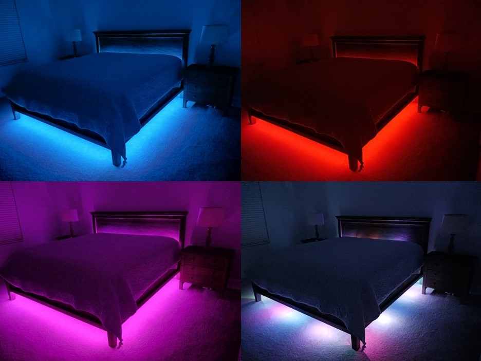

# Bed Light Server
This project contains the code that runs on a Raspberry Pi Pico W, hooked up to a WS2812b LED light strip. The Raspberry Pi Pico W acts as a web server. You can control the RGB settings and target LED's by making HTTP POST requests to the server. If you make an HTTP GET request to it, it will serve a simple interface to help you make these requests.



## Notes
Default IP address of the board I am using: **10.0.0.122**

## Example Requests
Set all LED's to 100, 150, 200 (RGB)
```
POST http://10.0.0.122
{
    "mode":"rgb",
    "r": 100,
    "g": 150,
    "b": 200
}
```

Setting only the top 180 degrees of lights (near head) to 30, 0, 0 (RGB):
```
POST http://10.0.0.122
{
    "mode":"rgb",
    "r": 30,
    "g": 0,
    "b": 0,
    "h0": 270,
    "h1": 90
}
```